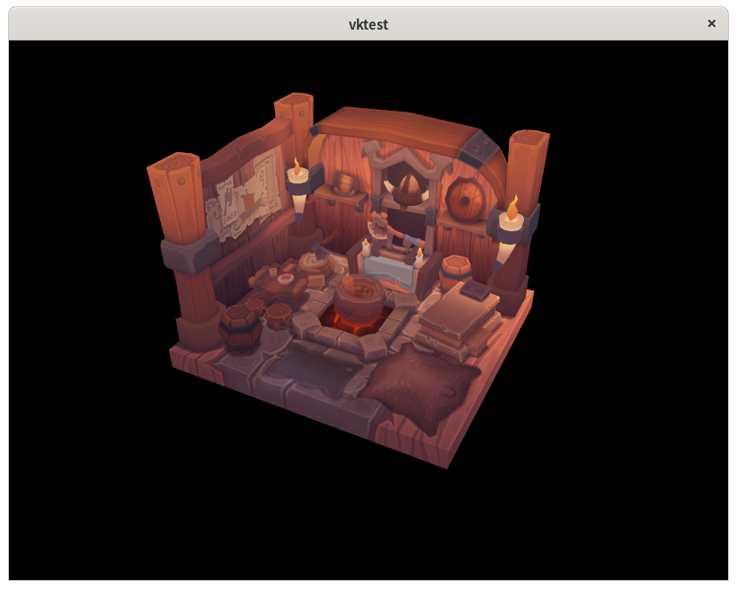

# vktest

An example Vulkan project based on https://vulkan-tutorial.com/, with some RAII
wrappers.



The 3D model is from: https://nigelgoh.artstation.com/projects/9OzxO

## Build

1. Clone:

```sh
$ git clone --recurse-submodules https://github.com/kosmospredanie/vktest
```

2. Build:

```sh
$ cd vktest
$ meson _build --buildtype=release
$ ninja -C _build
```

3. Run:

```sh
$ cd _build # not to omit
$ ./vktest/vktest
```
